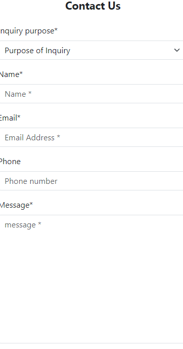
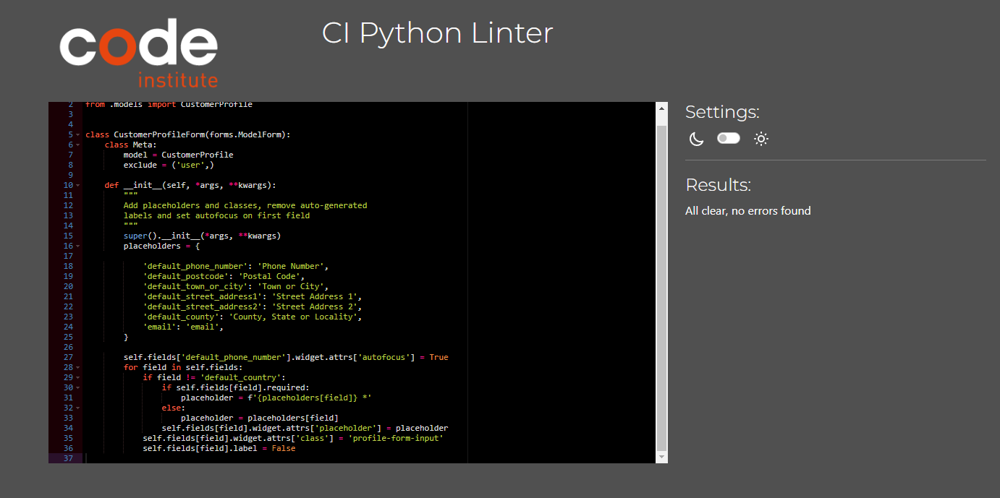

# PP5 UNDER DEVELOPMENT
(Developer: Bogdan Maria)

[View live website](https://bellacuccina-ccd2ee8f8d87.herokuapp.com/)

## Table of Contents
0. [About](#about)
1. [Project Goals](#project-goals)
    1. [User Goals](#user-goals)
2. [Business Model](#business-model)
    1. [SEO](#seo)
    2. [Marketing](#marketing)
    3. [Target Audience](#target-audience)
2. [User Experience](#user-experience)
    1. [User Requirements and Expectations](#user-requirements-and-expectations)
    2. [User Stories](#user-stories)
    3. [Site Owner Stories](#site-owner-stories)
3. [Design](#design)
    1. [Colours](#colours)
    2. [Fonts](#fonts)
    3. [Project Structure](#project-structure)
    4. [Database](#database)
    5. [Data Models](#data-models)
    6. [Wireframes](#wireframes)
    7. [Agile Design](#agile-design)
4. [Technologies Used](#technologies-used)
    1. [Languages & Frameworks](#languages--frameworks)
    2. [Libraries and Tools](#libraries--tools)
5. [Features](#features)
6. [Future Features](#future-features)

7. [Validation](#validation)
    1. [CSS](#css)
    2. [Html](#html)
    3. [Javascript](#javascript)
    4. [Python](#python)
    5. [Chrome Dev Tools Lighthouse](#lighthouse)
    6. [WAVE Validation](#wave)  
8. [Testing](#testing)

9. [Bugs](#bugs)

10. [Deployment](#deployment)
    1. [Heroku](#heroku)
    2. [AWS][#aws]
    2. [Forking GitHub Repo](#forking-the-github-repository)
    3. [Clone a GitHub Repo](#clone-a-github-repository)
12. [Credits](#credits)
    1. [Code](#code)
    2. [Tutorials](#tutorials)
    3. [Imagery](#imagery)
13. [Acknowledgements](#acknowledgements)

## Overview

BellaCuccina MArket Webstore is a Django full-stack e-commerce app designed to offer italin produce in an online shop. With its smooth user experience, dynamic content updates, and integration with the Stripe API, the webstore offers a reliable platform for customers to explore and purchase high-quality italian products. Webstore focuses on providing an effortless and logical interface. Through the use of AJAX calls,parts of the website content is updated dynamically, eliminating the need for page reloads and ensuring a seamless browsing experience. Users can explore various knife options, view detailed product descriptions, and add items to their shopping cart without interruptions.The underlying technology stack  includes the Django Full Stack Web Framework, which provides a solid foundation for developing scalable and robust web applications. Additionally, Bootstrap is utilized for front-end styling, resulting in a visually appealing and responsive design that adapts to different screen sizes.
To experience the  BellaCuccina Market Webstore, you can visit the deployed project using the provided link.
If you wish to test the purchase functionality, you can use the following mock payment details:

- Card Number: 4242424242424242
- Expiration Date: Any future date in the format MM/YY
- CVN: Any 3-digit number
- Postcode: Any 5-digit numeral

Please note that any payments made using actual payment cards will fail, and no charges will be incurred. The webstore is designed for demonstration purposes, and no orders made will be fulfilled.
Enjoy the BellaCuccina Market experince.
***
## Project (Site owner) Goals

- To offer users purchase of products listed on a webstore
- To give users a great user experience while visiting a webstore
- To give users option for buying as a guest or a registered user
- To allow user creating or updating an account
- To give users option to check the order history
- To give users option to leave a poduct review
- To give users option to save products on a wishlist

### User Goals

- View and search for products.
- Filter products based on criteria.
- Register and log into/out of an account.
- View and edit account profile.
- Add products to the shopping bag and make purchases.
- View order history.
- Write product reviews.
- Create and manage a wishlist.
- Contact the site owner or customer support.
- Sign up for a newsletter.

## Business Model

BellaCuccina Market was born out of a love for authentic Italian food and a desire to share the unparalleled quality and tradition of Italian ingredients with food enthusiasts around the world. From the rolling hills of Tuscany to the sun-drenched coastlines of Sicily, we source our products from trusted artisans and farmers who take pride in their craft, ensuring that every item meets the highest standards of quality and taste.

- Value Proposition:
    - Pasta: Discover our diverse collection of pasta, from classic spaghetti and penne to regional specialties like orecchiette and tagliatelle. Each variety is made using traditional methods and premium durum wheat, providing the perfect base for your favorite sauces and recipes.
    - Cured Meats: Our selection of cured meats includes an array of Italian delicacies such as prosciutto, salami, pancetta, and more. These artisanal meats are crafted using time-honored techniques and carefully aged to perfection, delivering rich, savory flavors that elevate any dish.
    - Fresh Produce: We bring you the freshest, highest-quality produce, from vibrant cherry tomatoes and crisp arugula to fragrant basil and robust zucchini. Our produce is sourced from local growers who prioritize sustainability and freshness, ensuring that you receive the best nature has to offer.

- Target market:
    - BellaCuccina Market's target market consists of a diverse group of consumers who share a passion for high-quality, authentic Italian food. 

- Customer Relationships:
    - Engage with customers through social media, email newsletters, and personalized communications to foster brand loyalty.
    -  Encourage customer feedback and reviews to continuously improve the product selection and overall shopping experience.

- Communication channels:
    - E-commerce website: Provide a user-friendly online platform where customers can browse, select, and purchase italian products.
    - Social media platforms: Utilize platforms like Instagram, Facebook, and Twitter to showcase the products, engage with the audience, and drive traffic to the webshop.

### SEO

- For this project I implemented a strong SEO strategy for my BellaCuccina Market web-shop in my Django project. First, I conducted thorough keyword research to identify the most relevant long and short-tail keywords for my products. I optimized my title tags, meta descriptions, and URLs, ensuring they included these keywords to improve my web-shop's visibility in search engine results. I also focused on creating high-quality content that naturally incorporated the identified keywords. For images, I used descriptive file names and alt tags to enhance their optimization. to improve the visibility of my web-shop in search engine rankings and attract potential customers searching for related products., I strategically used internal and external linking techniques

### Marketing

#### Facebook business page

- To assist with marketing the website and further boost its visibility, I have included a link to the web-shop's own Facebook Business Page in the footer section. This reciprocal link establishes a connection between the website and its social media presence, allowing visitors to easily access the Facebook page for additional updates, promotions, and engagement with the brand. You can visit the web-shop's Facebook page by clicking [here](https://www.facebook.com/profile.php?viewas=100000686899395&id=61560875649149).

### Target audience

- Home Cooks: Individuals who enjoy cooking at home and experimenting with authentic Italian recipes.
- Food Lovers: Consumers who appreciate the rich flavors and traditional methods of Italian cuisine.
- Food Connoisseurs: People who seek premium, artisanal ingredients for their culinary creations.
- Gourmet Food Enthusiasts: Customers who value high-quality, specialty food products.
- Quality-Conscious Shoppers: Consumers who look for minimally processed, natural ingredients.
- Italian Expatriates: Individuals living abroad who want to stay connected to their cultural roots through traditional Italian foods.

##### Back to [top](#table-of-contents)

## User Experience

### User Requirements and Expectations

- Intuitive and user-friendly website interface.
- Clear and detailed product descriptions.
- High-quality product images.
- Easy search and filtering options.
- Secure and seamless checkout process.
- Convenient account registration and login.
- Ability for customers to leave product reviews and ratings.
- Option to create and manage a personal wishlist of desired items.

### User stories

- From User/customer perspective
1. As an unauthenticated user/customer, I would like website navigation to be fast and easy
2. As an unauthenticated user/customer, I would like the ability to browse through all the products available on the site.
3. As an unauthenticated user/customer, I would like to search the website to see what kind of product are offered to purchase
4. As an unauthenticated user/customer, I would like to see a details of a products on a website such as(description, price)
5. As an unauthenticated user/customer, I would like functionality to refine my search of products on a website by
Price ,rating, and alphabet
6. As an unauthenticated user/customer, I would like functionality to select product and add it to my shopping basket
7. As an unauthenticated user/customer, I would like functionality to select multiple product and add it to my shopping basket
8. As an unauthenticated user/customer, I would like functionality to increase or decrease quantity of products in my shopping basket
9. As an unauthenticated user/customer, I would like functionality to register for an account  to a website
10. As an authenticated user/customer, I would like functionality to save and  edit my account information
11. As an authenticated user/customer, I would like functionality to see relevant info and my order history on my account page
12. As an authenticated user/customer, I would like functionality to delete an account(profile) if I find no use in using the website anymore
13. As an authenticated user/customer I would like functionality to add my details(shipping and billing) to a secure checkout form so that they could be saved along with my order to easier keep track of my past purchases
14. As user/customer, I would like functionality to put in my card details so that I can make a purchase
15. As an unauthenticated user/customer I would like to be able to view and read reviews of products to make informed purchasing decisions.
16. As an authenticated user/customer I would like functionality to leave a product review on a product detail page so that other customers deciding on purchase of the item will have an insight from somebody who already bought the product
17. As a authenticated user/customer I would Like functinality to edit or delete my product review so that information given in review are up to date and can help other users /customers
<!-- new ones -->
18. As an authenticated user/customer, I want to have the option to add products to my wishlist for future reference and easy access.
19. As an authenticated user/customer, I want to be able to remove items from my wishlist, so that I can manage my saved products effectively and remove those that I am no longer interested in
20. As an authenticated user/customer, I want to receive email notifications for order confirmations, shipping updates, and special promotions.
21. As an unauthenticated user/customer, I would like to be able to view and read reviews of products to make informed purchasing decisions.
22. As an authenticated user/customer, I would like to have the option to contact team or the site owner for any inquiries or assistance related to products or orders.
23. As an unauthenticated user/customer, I want to see links to the business's social media profiles on the website to stay connected and follow updates on different platforms.
24. As an unauthenticated user/customer, I want to have the option to contact the business through social media channels (such as Facebook, Instagram, or Twitter) for inquiries or support.
25. As an unauthenticated user/customer, if I encounter a page not found error, I want to be redirected to a relevant page or provided with suggestions to navigate back to valid areas of the site.

- From site owner perspective:
26. As a site owner, I want to provide secure payment options for customers, such as integrating with secure payment gateways (e.g. Stripe)
27. As a site owner, I want to be able to add new products to the webshop, including details like product name, description, price, and images.
28. As a site owner, I want to be able to delete existing products from the webshop that are no longer available or relevant.
29. As a site owner, I want to be able to update product information, such as descriptions, details, prices, and images, to keep the webshop content accurate and up to date.
30. As a site owner, I want to integrate a newsletter signup form  to capture user information and allow customers to subscribe for updates and promotions.
31. As a site owner, I want to ensure that error pages allow users to easily return to valid areas of the site without relying on browser controls.

## Design
***
### Colors

- In this project a carefully curated color palette has been implemented to create a visually appealing and user-friendly experience. The use of dark colors in the navigation and footer sections adds sophistication and draws attention to important elements, while a light background enhances readability and creates a pleasant browsing experience. The contrast between dark and light elements strikes a perfect balance between aesthetics and usability, showcasing the products effectively and providing an enjoyable browsing experience.

See color palette

### Fonts

- For this Project "Rubik" font was used
    - The use of Rubik fonts brings numerous benefits. The font family offers a range of weights that allow for clear and legible text, enhancing readability throughout the website. The modern and versatile design of Rubik fonts adds a touch of professionalism and sophistication to the overall aesthetic. With its balanced proportions and clean lines, Rubik fonts create a harmonious visual experience, ensuring that the content is easily digestible and
    visually appealing to users

See Rubik font

## Project Structure 
### Structure of Code

- This e-commerce project is structured using Django framework
and it is organized in app structure with apps clearly defining its purpose
and apps are as follows:
- Home - App contains landing page about webshop with a
call to action redirecting user to an all product pages, simple and intuitive navigation, footer with social media links and newsletter section.

- Products - app containing all product page with list of all products
,search and filter functionality and also add to cart and wishlist option buttons. Products are displayed within cards with 2 links(click on product image or an eye button) to a product detail page.
- Product detail page with adding,updating product quantity to shopping cart, Reviews section where authenticated user can add product reviews.
site owner CRUD functionality is part of this app also with included add and edit templates and delete button with confirmation modal for site owner.

- Shopping cart - App contains a cart template and functionality to view , update quantity remove and add to wishlist products inside shopping cart

- Checkout - the app is constructed to handle a payment form, list of products to be purchased and total amount of users order.

- Customer profile - app containing user account/profile data that can be updated and prefilled to make checkout experience smoother

- Reviews - app responsible for handling product reviews functionality
with review form, and full CRUD functionality

- Wishlist -app containing list of products that authenticated user can save to purchase or have as an products to review for later

### Code structure beside created apps

- settings.py: This file contains configuration settings for your Django project, such as database settings, installed apps, and middleware.
- Procfile: This file defines the commands executed during deployment of your Django app on a hosting platform.
- Templates: The project includes a base-level folder containing fundamental templates that are extended throughout other templates such as base.html, navigation, toast messages files and footer.html. It also includes templates for user authentication. Additionally, each app within the project has its own templates folder with HTML files that support the specific functionality and promote reusability within the app.
- Static: The project includes a "static" directory that contains the base CSS and JavaScript files. This directory serves as a central location for storing and organizing the static assets used throughout the project. In addition to the base-level files, each app within the project may have its own static directory to house CSS and JavaScript files specific to that app's functionality.

##### Back to [top](#table-of-contents)

## Database
***

### Data Models

#### User model

- User model as part of the Django allauth library contains basic information about authenticated user and contains folowing fields:
username, password,email

####  Product
- Product model made to represent webshop product containing all relevant fields giving user/customer information they need to make a desired purchase

| Name          | Database Key  | Field Type    | Validation |
| ------------- | ------------- | ------------- | ---------- |
|category       | category      | ForeignKey| 'Category', null=True, blank=True, on_delete=models.SET_NULL|
|item_no    | item_no   | CharField|  max_length=254, default=random_generated_string,unique=True|
|description     | description    | TextField|  |
| price      |  price     | DecimalField| max_digits=6, decimal_places=2 User|
| weight     | weight    | DecimalField|  max_digits=5, decimal_places=2 |
|image_url      | image_url   | URLField|  max_length=1024, null=True, blank=True|
|image      | image   | imageField| null=True, blank=True|

####  Category

- Model made to clearly separate usage and desing of various webshop products
containing bellow stated fields

| Name          | Database Key  | Field Type    | Validation |
| ------------- | ------------- | ------------- | ---------- |
|name      | name   | CharField|  max_length=254|
|notes       |notes     | TextField|  null=True, blank=True|
|slug      | slug     | SlugField| max_length=254, blank=True, null=True|
|friendly_name      | friendly_name     | CharField|  max_length=254, null=True, blank=True|

####   CustomerProfile

- Model representing an account of a registered user containing
following fields:

| Name          | Database Key  | Field Type    | Validation |
| ------------- | ------------- | ------------- | ---------- |
|user       | user     | OneToOneField|  User, on_delete=models.CASCADE|
|default_phone_number      | default_phone_number     | CharField|  max_length=20, null=True, blank=True|
|default_country       |default_country    | CountryField|  blank_label='Country *', null=True, blank=True|
|default_postcode       | default_postcode     | CharField| max_length=20, null=True, blank=True|
|default_town_or_city       | default_town_or_city     | CharField| max_length=20, null=True, blank=True|
|default_stereet_address1       | default_stereet_address1     | CharField| max_length=20, null=True, blank=True|
|default_street_address2       | default_street_address2     | CharField| max_length=20, null=True, blank=True|
|default_county       | default_county     | CharField| max_length=20, null=True, blank=True|

####  Contact

- Model made with purpose of storing contact info between user and business with bellow stated fields:

  INQUIRY_CHOICES = [
        ('', 'Purpose of Inquiry'),
        ('PRODUCT', 'Poduct Inquiry'),
        ('ORDER', 'Order Inquiry'),
        ('SUGGESTIONS', 'Suggestions'),
        ('OTHER', 'Other'),
    ]

| Name          | Database Key  | Field Type    | Validation |
| ------------- | ------------- | ------------- | ---------- |
| inquiry_purpose  |inquiry_purpose      | CharField|  max_length=24, choices=INQUIRY_CHOICES |
|name        |name      | CharField|  max_length=100|
|email       |email      | EmailField|  max_length=100|
|phone      |phone     | CharField|  max_length=20, blank=True, null=True|
| message      | message     | TextField|  max_length=1000|
| date_submmited     | date_submmited    | DateTimeField|  auto_now_add=True|

#### Order

- Model storing information relevant to customer webshop order ,containing
fields:

| Name          | Database Key  | Field Type    | Validation |
| ------------- | ------------- | ------------- | ---------- |
|order_number       | order_number     | CharField|  max_length=32, null=False, editable=False|
|user_profile        |user_profile       | ForeignKey|  CustomerProfile,on_delete=models.SET_NULL, null=True,blank=True, related_name='orders'|
|full_name        | full_name    | CharField|  max_length=50, null=False, blank=False|
| email     | email    | EmailField| max_length=254, null=False, blank=False|
|phone_number       | phone_number     | CharField|  max_length=20, null=False, blank=False|
| country       | country      | CountryField|  blank_label='Country *', null=False, blank=False|
| postcode      | postcode     | CharField|  max_length=20, null=True, blank=True|
| town_or_city      |  town_or_city    | CharField|  max_length=40, null=False, blank=False|
|street_address1       | street_address1     | CharField|  max_length=80, null=False, blank=False|
|street_address2       | street_address2     | CharField|  max_length=80, null=False, blank=False|
|county        | county      | CharField|  max_length=80, null=True, blank=True|
|date       | date     | DateTimeField|  auto_now_add=True|
|order_total       | order_total     | DecimalField|  max_digits=10, decimal_places=2, null=False, default=0|
|grand_total       | grand_total     | DecimalField|  max_digits=10, decimal_places=2, null=False, default=0|
|original_cart       | original_cart     | TextField|  null=False, blank=False, default=''|
|stripe_pid       | stripe_pid     | CharField|  max_length=254, null=False, blank=False, default=''|

####  OrderLineItem

- model representing single product in a user order

| Name          | Database Key  | Field Type    | Validation |
| ------------- | ------------- | ------------- | ---------- |
| order      | order     | ForeignKey|  Order, null=False, blank=False, on_delete=models.CASCADE, related_name='lineitems'|
|product       | product    | ForeignKey|  Product, null=False,blank=False, on_delete=models.CASCADE|
|quantity       | quantity     | IntegerField|  null=False, blank=False, default=0|
|lineitem_total      | lineitem_total    | DecimalField|  max_digits=6,decimal_places=2, null=False blank=False, editable=False|

####  Review

- Model representing reviews for each product

| Name          | Database Key  | Field Type    | Validation |
| ------------- | ------------- | ------------- | ---------- |
| author     | author    | ForeignKey|  User,on_delete=models.SET_NULL,null=True, blank=True|
|product      | product     |ForeignKey|  Product, on_delete=models.CASCADE|
|content       | content      | CharField|  max_length=1024|
|time_posted        | time_posted     | TimeField|  auto_now_add=True|

### Wireframes

Big screens - laptop & desktop

Home page

All products

Product detail

Shopping cart

Checkout

Profile

Add product

Authentication pages

Wishlist

Contact & about

***

Small screens

Home page

All products

Product detail

Shopping cart

Checkout

Profile

Add product

Authentication pages

Wishlist

Contact & about

## Agile Design

### Overview

- For this project Agile principles and design was implemented from a start since this was the 2nd time in my development career that im implementing agile. While process was familiar, plan was set from beginning and it was adjusted along the way. Drawing from my previous experience, I knew that Agile would empower me to embrace change and prioritize tasks efficiently, ensuring that I consistently delivered incremental value to my project.I leveraged techniques such as user stories,kanban boards an milestones to maintain a clear project vision.This time kanban board are constructed by iterations(sprints)This iterative development cycle gave mae a regular chance to review and try to refine my work.Overall, learning and implementing Agile as a solo developer working on my e-commerce project has been a highly rewarding experience.By implementing Agile principles and design, I was confident in delivering a high-quality and user-focused e-commerce solution.

### Epics(Milestones)
- By effectively leveraging GitHub's 'Milestones' feature and thoughtfully connecting user stories to their corresponding tasks.

See epics

### User stories

- I started by creating a user story template using GitHub issues. As the project progressed, these initial rough sketches evolved and were refined into complete user stories.

 Template for User story 

 User story ticket

 User story finished

Using Agile methodologies for my solo e-commerce project, I made steady progress by breaking tasks into smaller parts. This approach allowed me to prioritize and deliver important features step by step. With continuous feedback and adjustments, I improved the development environment, implemented crucial functionalities, and built a user-friendly e-commerce platform. Agile proved to be a valuable framework, helping me navigate complexities, achieve tangible results, and prioritize user satisfaction.

## Technologies Used

### Languages & Frameworks

- HTML5
- CSS3
- JavaScript
    - ajax
- jQuery
- Python 3.10.2
- Django 3.2

### Libraries & Tools

- [Bootstrap 5.1](https://getbootstrap.com/). This project uses the Bootstrap library for UI components (Buttons, Card, Footer, Modal, Navbar)
- [AWS (Amazon Web Services)](https://aws.amazon.com/) was utilized in this project for hosting image files. An S3 bucket on AWS was created to store and serve the project's images, providing a reliable and scalable solution for managing and delivering the visual assets. With AWS, the project benefits from secure and efficient storage capabilities, ensuring seamless access to images throughout the application.
- [Stripe](https://stripe.com/) Stripe is integrated into the project to handle payment processing. It provides a secure and convenient way to handle online payments, including credit card transactions.
- [Balsamiq](https://balsamiq.com/) to create the projects wireframes
- [Am I Responsive](http://ami.responsivedesign.is/) was used for creating the multi-device mock-up at the top of this README.md file
- [Lucidchart.com](https://www.lucidchart.com/) for creating Entity relationship diagrams(ERD) of my project database
- [Favicon.io](https://favicon.io) for making the site favicon
- [Chrome dev tools](https://developers.google.com/web/tools/chrome-devtools/) was used for debugging of the code and checking site for responsiveness
- [Boostrap icons](https://fontawesome.com/) - Icons from Bootstrap icons  were used throughout the site
- [GitPod](https://gitpod.io/) was used for version control to push the code to GitHub
- [GitHub](https://github.com/) was used as a remote repository to store project code
- [Google Fonts](https://fonts.google.com/) - for typography in project
- [Design.com](https://www.design.com/)- for making the custom website logo

## Features

### Nav-bars and Logo
- The navbar, an integral component of the e-commerce store website, is implemented consistently throughout the entire project. It serves as a navigational element that allows users to easily access different sections and pages of the website. The navbar remains present and accessible on every page, ensuring a seamless browsing experience for users as they navigate through the various sections and features of the e-commerce store.And giving users accurate info about state of the shopping cart(number of items in and total price of all items in a shopping cart), and number of products saved in a wishlist.
- User Story covered with this feature:

See Nav-bars and Logo

### Footer
- The footer feature is included in most of the project templates, except for the user authentication templates. This decision was made because including the footer in those templates could disrupt the flow and divert the user's attention from the specific purpose of the user authentication process.

See Footer

- Features included in projects pages

### Landing page

1. Landing Page Carousel:

- A captivating slideshow on the landing page that serves as a call to action, enticing users to explore the product offerings. It provides visually appealing images and compelling slogan, leading users to click and navigate to all products page for more details and to make purchases.

See Landing Page Carousel 

2. Search sidebar :

- A user-friendly sidebar feature for quick and efficient product searches within the e-commerce store. Users can enter keywords or product names to find desired items or categories easily. Enhancing navigation and the overall shopping experience, the search sidebar simplifies the process of finding specific products.

See Search sidebar 

3. Best sellers section:
- Section dedicated of showing a 3 products from a store with Intention of presenting them
as the best selling webshop products.

See Best sellers section

4. Media marketing section:
-  Includes a newsletter Sign-up form. This section facilitates user engagement and promotes the e-commerce store through effective email marketing.

See Media marketing section

### All products page

1. Filter section:

- Allows users to refine product searches on the "All Products" page. Users can easily narrow down their search by selecting various criteria such as price,category, name. Enhancing usability, the filter section helps users quickly find the desired products within the webshop.

See Filter section

2. Product card:

- The Product Card feature enhances the user experience by displaying a visually appealing image of the product along with essential information such as price, weight and interactive button  add to wishlist and button add shopping cart(via AJAX). It provides users with a convenient way to browse, evaluate, and add products to their shopping experience.

See Product card

### Product detail page

1. Product detail feature section:

- The Product Detail Section feature offers comprehensive information about a product, catering to both regular users and site owners. Key elements of this feature include:

    - product Image ,by clicking on it it opens image in separate tab

    - Add to Wishlist Button: Users can easily add the product to their wishlist for future reference or purchase.

    - Edit and Delete Product Buttons (for site owners): Site owners have exclusive access to buttons that allow them to edit or remove the product from the inventory.

    - Product Description: A detailed description of the product is provided, offering users valuable insights and information about its features, specifications, or any other relevant details.

    - Product Unique Number: Each product is assigned a unique identification number, allowing for easy tracking and identification.

    - Product weight: user can find the weight of the product.

    The Product Detail Section feature enables users to make informed decisions and provides site owners with the necessary tools to manage and customize their product offerings.

See Product detail feature section

2. Add to shopping cart feature section:

-  The Add to Shopping Cart Section feature provides a seamless and user-friendly experience for adding products to the shopping cart. It includes the following components:
The Quantity Input Buttons: Users can easily adjust the quantity of the product they wish to add to the shopping cart. The input buttons allow them to increase or decrease the quantity as desired.
The Confirm Button: Once users have selected their desired quantity, they can click the confirm button to add the product to their shopping cart. This ensures a clear and straightforward process for users.
The Shop Button: After adding the product to the shopping cart, users can click the shop button to return to the all products page. This button allows users to continue browsing and exploring other products available on the website.

The Add to Shopping Cart Section feature streamlines the process of adding products to the shopping cart, giving users control over the quantity and simplifying the overall shopping experience. design and layout remains the same for all screen sizes

See Add to shopping cart  feature section

3. Product reviews feature section:

- The Product Reviews Feature Section enables users to provide feedback and share their experiences with a particular product. It consists of the following components:

    - Review Input Form: Users can input their reviews by filling out a form. This form  includes  only text field.

    - Submit Review Button: After composing their review, users can click the submit button to submit their feedback. This action adds their review to the product's review section.

    - Edit and Delete Review Buttons: For users who have previously submitted reviews, the feature provides edit and delete buttons. This allows reviewers to make changes or remove their review if necessary.

    - Reviewer's Name and Time Elapsed: Each review is accompanied by the name of the reviewer, providing transparency and credibility. Additionally, the time elapsed since the review was created or last updated is displayed, indicating the freshness of the review.

    The Product Reviews Feature Section encourages user engagement and empowers customers to contribute their thoughts and opinions. It facilitates an open and interactive environment where users can share, edit, and delete their reviews, allowing for an authentic and dynamic feedback system.

Product reviews feature section

### Shopping cart page

1. Shopping cart table feature section:

- The Shopping Cart Table Feature Section provides a clear and organized representation of the items added to the shopping cart. It includes the following components for each product:

    - Small Product Image: A visually appealing small image of the product is displayed in the shopping cart table, allowing users to easily identify the item.

    - Price: The price of the product is prominently shown in the table, providing users with a quick reference to the cost.

    - Quantity Input Buttons: Input buttons are provided to allow users to adjust the quantity of the product within the shopping cart. This enables easy modification of the desired quantity.

    - Edit and Delete Buttons: The feature includes edit and delete buttons for each product, giving users the ability to make changes or remove items from their shopping cart as needed.

    The Shopping Cart Table Feature Section enhances the shopping experience by presenting a concise overview of the products in the cart. Users can effortlessly manage the quantity, edit product details, or remove items, ensuring a seamless and personalized shopping journey.

 See Shopping cart table  feature section

2. Summary table feature section:

- The Summary Table Feature Section enables users to quickly review the selected products, their quantities, and prices before proceeding to checkout. It provides a clear and concise summary of the order, allowing users to make informed decisions and proceed to the secure checkout process with ease.
It includes the following components:

  - Product Name: The names of the products are displayed in the summary table, allowing users to easily identify the items they have selected.

  - Product Quantity: The quantity of each product is listed, providing a clear representation of the quantity chosen by the user for each item.

  - Product Price: The price of each product is displayed alongside the corresponding quantity, giving users a clear understanding of the individual costs.

  - Total Price Calculation: The feature automatically calculates the total price by summing up the prices of all the selected products based on their quantities. This provides users with an instant overview of the overall cost.

  - Secure Checkout Button: A button is provided in the summary table, allowing users to proceed to the secure checkout process. Clicking this button initiates the checkout process, where users can enter their payment and shipping details.

See Summary table feature section

3. Back to shop button:

- Simple feature helping users navigate back to all products page

See Back to shop button

### Checkout page

1.  Checkout Order form:

- The checkout Order Form Feature Section facilitates the process of placing an order by providing a user-friendly form where customers can enter their relevant information. It includes the following components:

Personal Information: The order form includes fields for customers to enter their personal details  name, shipping address, email address,county, postcode, country and contact number. This information is necessary for the accurate delivery of the order and communication with the customer.

Save delivery info part of form where customer can make his next shopping experience even faster with checking the box to save form information to his profile for next purchase.

Checkout Order form feature section

2. Payment feature section:

- The Payment Feature Section enables customers to securely complete their purchase by providing a streamlined payment process. It includes the following components:

    - Payment Field for Card Details: Customers can enter their payment information, typically including the card number, expiration date, CVV code, and cardholder name, into the designated payment field. This ensures the secure transmission of sensitive payment data.

    - Confirm Payment Button: A confirm payment button is available for customers to authorize and finalize the payment transaction. Clicking this button initiates the payment process, securely charging the provided payment method.

    - Button to Go Back and Adjust Shopping Cart: A button is provided to allow customers to easily navigate back to the shopping cart section. By clicking this button, customers can review and adjust the contents of their shopping cart before proceeding with the payment.

    - Red font prompt with a total amount that customer card will be charged

The Payment Feature Section ensures a smooth and secure payment experience for customers. By providing a dedicated field for card details and a confirm payment button, customers can swiftly and confidently complete their purchase. Additionally, the inclusion of a button to go back and adjust the shopping cart allows customers to make any necessary modifications before finalizing their payment.

 See payment feature section

2. Checkout order summary section:

- The Checkout Order Summary Section provides customers with a clear and concise overview of their order details before finalizing the checkout process. It includes the following components:

    - Product Image: A visual representation of the product, typically an  image,  is displayed in the order summary section. This allows customers to visually identify the items they are about to purchase.
    - Product Quantity: The quantity of each product selected by the customer is shown in the order summary. This provides a quick reference to the number of items included in the order.

    - Total Order Price: The total price of the entire order is prominently displayed in the checkout order summary section. This includes the cumulative cost of all selected products, considering their respective quantities and any applicable taxes or discounts.

The Checkout Order Summary Section ensures transparency and allows customers to review their order details at a glance. By providing product images, quantities, and the total order price, customers can verify their selection before proceeding with the checkout process.

 Checkout order summary  feature section

### Checkout success page

1. Order confirmation thank you form feature:

- The Order Confirmation Thank You Form Feature provides customers with a confirmation of their order and essential information related to the transaction. It includes the following components:

    - Order Number: A unique order number is displayed in the order confirmation form, serving as a reference for customers to track their order or address any inquiries related to it.

    - Date: The date of the order placement is shown, providing customers with a timestamp of their purchase for their records.

    - Delivery Information: The order confirmation form includes relevant details about the delivery, such as the  address , name town phone number

    - Billing Information: The form displays the billing information associated with the order, which typically includes the billing address and payment method used. Customers can review this information to ensure it matches their expectations and records.

The Order Confirmation Thank You Form Feature serves as a confirmation and acknowledgment of the customer's order. By providing the order number, date, delivery information, and billing details, customers can have peace of mind knowing that their order has been successfully placed and that the provided information is accurate.

 Order confirmation thank you form  feature section

2. Buttons feature section:

- section provides two buttons. back to shop and return to profile button , making navigation even easier.

Buttons feature section

### Profile page

1. Profile form feature:

- The Profile Form Feature allows users to provide and update their basic information and delivery details within their profile. It includes the following components:

    - Basic Info Fields: Users can fill out basic information fields such as their name, contact details (phone number, email address), and other relevant personal information. These fields provide a means for users to provide accurate and up-to-date information for their profile.

    - Update profile button: users can confirm update of a profile form

See Profile form feature section

2. Order history accordion feature:

- The Order History Accordion Feature provides users with a convenient way to access and view their order history. It includes the following components:

    - Order Info: The order history accordion displays essential order information, such as the order number, order total, and the date and time the order was placed. This summary allows users to quickly identify and locate specific orders.

    - Clickable Order Number: Each order within the accordion is presented with a clickable order number. Clicking on the order number leads the user to a thank you page or a detailed order confirmation page, providing a more comprehensive view of the order and its associated details.

    - Order Details: The expanded view within the accordion reveals the order details, including product names, quantities, and any other relevant information pertaining to the order. This gives users a comprehensive breakdown of the items included in each order.

    - Product Quantity: The order history accordion specifies the quantity of each product ordered, providing users with a clear understanding of the quantities associated with each item.

    - Order Total and Date/Time: The total cost of the order is displayed, giving users a quick reference to the overall price of each order. Additionally, the date and time of the order are provided, enabling users to track and review their purchase history over time.

See Order history accordion feature section

### Add product page

1. Add product form feature section:

- The Add Product Form Feature allows users to create a new product by filling out a form with the following fields: name, image upload, description, price, weight. It also includes buttons to add the product and cancel the process. This feature simplifies the process of adding new products by providing a straightforward and intuitive form for users to enter all the necessary details.

See Add product form  feature section

### About us page

1. Hero with supporting history paragraph feature:

- The Hero with Supporting History Paragraph Feature presents a striking hero image accompanied by a concise paragraph introducing the webshop and its site owner. This feature creates an impactful first impression, conveying the essence of the webshop and establishing a connection with visitors.

See Hero with supporting history paragraph feature section

3. Contact form feature section:

- The Contact Form Feature Section incorporates a user-friendly contact form that facilitates seamless communication between the website and its visitors. This feature includes a selection of inquiry purposes, such as order-related inquiries, product queries, suggestions, and other custom options. The contact form empowers users to express their specific needs and enables the website to provide prompt and tailored responses to their inquiries.

See Contact form feature section

## Future features

- For future releases of this web, there are plans to implement new features and enhance existing ones to further improve the user experience. These updates will focus on incorporating innovative functionalities and refining the existing features based on user feedback and market trends. The goal is to continuously evolve the web and ensure that it remains up-to-date, user-friendly, and aligned with the changing needs and expectations of our valued users.

    1. Gift cards (physical gif-cards in various amounts with web-shop logo)
    2. Add AI powered chatbot function to enhance customer experience and support
    3. Add more types of payment options(paypal, gift-cards,crypto currencies)

## Validation
***

### CSS
- [Jigsaw W3 Validator](https://jigsaw.w3.org/css-validator/)was used  to validate the css in the project
    - web app passed validator with no errors.
    

base.css

    
    

       

about.css

    
    

       

checkout.css

    
    

       

profile.css

    
    

### Html

-  [WC3 Validator](https://validator.w3.org/) was used for the validation of projects html code. All messages hidden are related to the use of Django.

Home

All products

Product detail

Shopping cart

Checkout

Checkout success

Profile

Wishlist

About

Add product

Login

Logout

Register

404 error

500 error

### Javascript
- [JShint](https://jshint.com/) was used to validate custom script file
- JS files are passing validator without errors

   

Js files

    

main.js

    
    

    

reviews.js

    
    

    

### Python
- [CI Python Linter](https://pep8ci.herokuapp.com/) to check  Python code for validity and conventions

    

home app

    

views.py

    
    

    

urls.py

    
    

    

    ***

    

checkout app

    

views.py

    
    

    

models.py

    
    

    

urls.py

    
    

    

signals.py

    
    

    

webhooks.py

    
    

    

webhook_handler.py

    
    

    

    ***

    

contact_about app

    

views.py

    
    

    

models.py

    
    

    

urls.py

    
    

    

forms.py

    
    

    

    ***

    

cust_profile app

    

views.py

    
    

    

models.py

    
    

    

urls.py

    
    

    

forms.py

    
    

    

    ***

    

products app

    

views.py

    
    

    

models.py

    
    

    

urls.py

    
    

    

forms.py

    
    

    

    ***

    

shop_cart app

    

views.py

    
    

    

urls.py

    
    

    

context.py

    
    

    

    ***

    

reviews app

    

views.py

    
    

    

models.py

    
    

    

urls.py

    
    

    

forms.py

    
    

    

    ***

    

wishlist app

    

views.py

    
    

    

models.py

    
    

    

urls.py

    
    

    

context.py

    
    

    

    ***